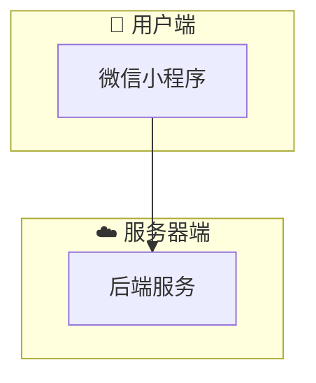

# @eastgold15/slidev-theme-jingjiang

[](https://www.npmjs.com/package/@eastgold15/slidev-theme-jingjiang)

深紫哑光磨砂政务风 Slidev 主题 —— 适配述职汇报、方案评审、项目分析、学术答辩等正式汇报场景。

## 安装

在 `slides.md` 的 frontmatter 中添加：

```yaml
---
theme: "@eastgold15/slidev-theme-jingjiang"
---
```

然后启动 Slidev，它会自动提示安装主题。

## 布局 Layouts

| 布局名 | 说明 |
|--------|------|
| `cover` | 封面页，居中对称大标题 + 副标题 + 分割线 + 页脚 |
| `intro` | intro 页，同封面风格 |
| `circletl-br` | 左上 + 右下双透明圆装饰背景 |
| `circletr-bl` | 右上 + 左下双透明圆装饰背景 |

使用方式：

```yaml
---
layout: circletl-br
---
```

## 组件 Components

### MermaidView

流程图/图表的可缩放查看容器。鼠标滚轮缩放（以光标为中心），拖拽平移。

```markdown
<MermaidView :max-height="480">



</MermaidView>
```

| 属性 | 类型 | 默认 | 说明 |
|------|------|------|------|
| `max-height` | string | `400px` | 容器最大高度 |

操作：
- **滚轮**：以鼠标位置为中心缩放
- **拖拽**：平移视图
- **右上角 +/-**：以画面中心缩放
- **⟲**：重置缩放

---

### ScrollView

无滚动条的滚动容器。滚轮垂直翻页，Shift+滚轮水平移动。

```markdown
<ScrollView max-height="400px">
超长内容在这里自动滚动...
</ScrollView>
```

| 属性 | 类型 | 默认 | 说明 |
|------|------|------|------|
| `max-height` | string | `100%` | 容器最大高度 |
| `max-width` | string | `100%` | 容器最大宽度 |

操作：
- **滚轮**：垂直翻页（默认）
- **Shift + 滚轮**：水平平移
- 滚动条隐藏，不影响触控板手势

---

### Card

磨砂质感卡片容器，支持左侧装饰条、标题、多尺寸。

```markdown
<Card title="标题" accent="#F9D240">
卡片内容
</Card>
```

| 属性 | 类型 | 默认 | 说明 |
|------|------|------|------|
| `accent` | string | `#F9D240` | 左侧装饰条颜色 |
| `show-accent` | boolean | `true` | 是否显示装饰条 |
| `padding` | number | `6` | 内边距（UnoCSS p-X） |
| `size` | `normal \| full \| sm` | `normal` | 卡片尺寸 |
| `title` | string | — | 卡片标题（带底部分割线） |
| `mb` | number | `0` | 底部外边距 |

示例：

```markdown
<Card title="默认卡片" accent="#F9D240" padding="6">
  标准磨砂卡片
</Card>

<Card :show-accent="false" size="full">
  底部通栏大卡片，无装饰条
</Card>

<!-- 双栏并列 -->
<div class="grid grid-cols-2 gap-4">
  <Card title="左栏" padding="4" />
  <Card title="右栏" padding="4" />
</div>
```

**使用注意：**
- Card 标签**上下必须空一行**，否则 Markdown 不会正确渲染
- **不要嵌套 Card**，内层用 `.section-accent` 替代
- 纯数字展示用 `.data-block` 替代 Card，避免视觉疲劳

---

### Toc

目录导航组件，展示演示文稿的章节列表。

```markdown
<Toc :items="[
  {icon: '🎯', number: '①', title: '项目概述', tag: '🌟 所有人'},
  {icon: '💰', number: '②', title: '成本估算', tag: '🌟 所有人'},
]" />
```

| 属性 | 类型 | 说明 |
|------|------|------|
| `items[].icon` | string | 图标 emoji |
| `items[].number` | string | 序号（① ② ③） |
| `items[].title` | string | 章节标题 |
| `items[].desc` | string | 补充说明 |
| `items[].tag` | string | 受众标签 |

---

### Timeline

横向阶段线组件，适合展示项目排期、开发时间线。

```markdown
<Timeline :steps="[
  {icon: '📄', label: '需求分析', period: '第1-2周', accent: '#F9D240'},
  {icon: '☁️', label: '后端开发', period: '第3-6周', accent: '#7EC8E3'},
  {icon: '📱', label: '前端开发', period: '第4-8周', accent: '#6BCB9C'},
  {icon: '🚀', label: '上线发布', period: '第10周', accent: '#C792EA'},
]" />
```

| 属性 | 类型 | 说明 |
|------|------|------|
| `steps[].icon` | string | 图标 emoji |
| `steps[].label` | string | 阶段名称 |
| `steps[].period` | string | 时间周期 |
| `steps[].desc` | string | 补充描述 |
| `steps[].accent` | string | 顶部色条颜色 |

---

## 样式工具类

### 轻量容器

| 类名 | 作用 |
|------|------|
| `.section-accent` | 左侧色条分区，无背景色，适合纯文字段落 |
| `.highlight-box` | 结论强调框，有磨砂底但无装饰条 |
| `.data-block` | 数据展示容器，纯文字无背景 |
| `.data-value` | 数据值（金黄大号加粗） |
| `.data-label` | 数据标签（浅灰小字） |

---

## 主题切换

在 slide 的 frontmatter 中添加 `class` 切换配色：

| class | 场景 |
|-------|------|
| —（默认） | 深紫哑光政务风 |
| `theme-light` | 浅紫清爽，对外宣讲/答辩 |
| `theme-project` | 浅灰白底，方案评审/商业计划 |

```yaml
---
layout: circletl-br
class: "theme-project"
---
```

## 配色（默认主题）

| 用途 | 色值 | 说明 |
|------|------|------|
| 页面背景 | `#42205C` | 哑光深紫 |
| 卡片底色 | `#532B73` | 磨砂紫 |
| 表头底色 | `#4C2668` | 加深紫 |
| 分割线 | `#9D78C2` | 浅紫 |
| 高亮数据 | `#F9D240` | 金黄 |
| 辅助文字 | `#D1C4E0` | 浅灰紫 |
| 总计/强调 | `#9E2B42` | 暗酒红 |

## 开发

```bash
npm install
npm run dev      # 预览 example.md
npm run build    # 构建
npm run export   # 导出 PDF
```

---

Built with [Slidev](https://sli.dev/).
