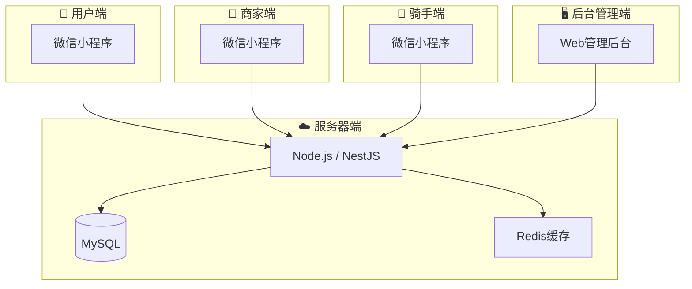

# @eastgold15/slidev-theme-jingjiang

主题组件与样式示例大全

<div class="pt-12">
  <span @click="$slidev.nav.next" class="px-2 py-1 rounded cursor-pointer" flex="~ justify-center items-center gap-2" hover="bg-white bg-opacity-10">
    Press Space for next page <div class="i-carbon:arrow-right inline-block"/>
  </span>
</div>

---
layout: circletl-br
---

# Outline 目录导航组件

使用 `<Outline>` 展示演示文稿章节列表，自动带序号、图标、标签：

<Outline :items="[
  {icon: '🎯', number: '①', title: '组件概览', desc: '所有组件一览', tag: '🌟 所有人'},
  {icon: '📦', number: '②', title: 'Card 卡片', desc: '磨砂卡片用法', tag: '🌟 所有人'},
  {icon: '📋', number: '③', title: 'Outline 目录', desc: '就是本页', tag: '🌟 所有人'},
  {icon: '', number: '④', title: 'Timeline 时间线', desc: '阶段展示', tag: '🌟 所有人'},
  {icon: '🧩', number: '⑤', title: '原子组件', desc: 'AtomBox / Flex / Text / Badge / Btn', tag: '🌟 所有人'},
  {icon: '🎨', number: '⑥', title: '样式工具类', desc: 'Card 四方向 / DataBlock', tag: '🌟 所有人'},
  {icon: '🔄', number: '⑦', title: '主题切换', desc: 'theme-project 浅色主题', tag: '🟡 技术参考'},
]" />

---
layout: circletr-bl
---

# Card 统一容器

整个主题唯一的容器组件。默认是磨砂底无装饰条，通过属性变成任意形态。

<ScrollView max-height="460px">

**❶ 默认：磨砂底，无装饰条（旧 highlight-box）**
<Card>
结论/强调框，磨砂紫底，干净无装饰
</Card>

**❷ 磨砂底 + 左侧装饰条（经典 Card）**
<Card accent="#F9D240" title="经典卡片" class="mt-4">
左侧金黄装饰条 + 磨砂紫底
</Card>

**❸ 磨砂底 + 顶部装饰条**
<Card accent="#F9D240" accent-side="top" title="顶部色条" class="mt-4">
装饰条可以在上/下/左/右四个方向
</Card>

**❹ 无背景 + 左侧装饰条（旧 section-accent）**
<Card :matte="false" accent="#F9D240" class="mt-4">
无磨砂背景，只有左侧色条，适合纯文字分区
</Card>

**❺ 双栏并列**
<div class="grid grid-cols-2 gap-4 mt-4">
<Card title="左栏" padding="4">内容</Card>
<Card title="右栏" padding="4">内容</Card>
</div>

**❻ 内嵌表格**
<Card title="数据总览" class="mt-4">
| 项目 | 数值 | 备注 |
|------|------|------|
| 项目A | <span class="text-data">320</span> | 正常 |
| **合计** | <span class="text-total">500</span> | |
</Card>

**❼ 无背景 Card 做内层（替代旧版嵌套）**
<Card title="外层" class="mt-4">
<Card :matte="false" accent="#F9D240">内层无背景分区</Card>
</Card>
</ScrollView>

**使用注意：** Card 标签上下必须空一行（已用 CSS 压平间距）；不要嵌套两个磨砂 Card，内层用 `:matte="false"`

---

# Timeline 时间线组件

横向阶段块，每块带顶部色条和图标，适合项目排期。

```markdown
<Timeline :steps="[
  {icon: '📄', label: '需求分析', period: '第1-2周', accent: '#F9D240'},
  {icon: '☁️', label: '后端开发', period: '第3-6周', accent: '#7EC8E3'},
  {icon: '📱', label: '前端开发', period: '第4-8周', accent: '#6BCB9C'},
  {icon: '🚀', label: '上线发布', period: '第10周', accent: '#C792EA'},
]" />
```

效果：

<Card :show-accent="false" padding="4">
<Timeline :steps="[
  {icon: '📄', label: '需求分析', period: '第1-2周', desc: '产品设计', accent: '#F9D240'},
  {icon: '☁️', label: '后端开发', period: '第3-6周', desc: 'API接口', accent: '#7EC8E3'},
  {icon: '📱', label: '前端开发', period: '第4-8周', desc: '多端并行', accent: '#6BCB9C'},
  {icon: '🧪', label: '联调测试', period: '第7-9周', desc: 'Bug修复', accent: '#FFB74D'},
  {icon: '🚀', label: '上线发布', period: '第10周', desc: '运营准备', accent: '#C792EA'},
]" />
</Card>

---
layout: circletl-br
---

# Card 四种装饰条方向

`accent-side` 控制装饰条在上/下/左/右。

<Card title="四方向对比" padding="4">
<div class="grid grid-cols-2 gap-4">
<Card accent="#F9D240" accent-side="left" padding="4">
**← 左侧**（默认）<br>经典竖向装饰条
</Card>
<Card accent="#7EC8E3" accent-side="right" padding="4">
**→ 右侧**<br>色条在右边
</Card>
<Card accent="#6BCB9C" accent-side="top" padding="4">
**↑ 顶部**<br>横线在顶端
</Card>
<Card accent="#E57373" accent-side="bottom" padding="4">
**↓ 底部**<br>横线在底端
</Card>
</div>
</Card>

---

# Card 无背景模式（替代旧 section-accent）

`:matte="false"` 去掉磨砂背景，只剩装饰条。适合纯文字分区，视觉更轻。

```markdown
<Card :matte="false" accent="#F9D240">
**标题** 一段说明文字
</Card>
```

效果（三栏并排）：

<Card padding="4">
<div class="grid grid-cols-3 gap-4">
<Card :matte="false" accent="#F9D240">

**📊 信息过载**
全国 3000+ 所高校<br>700+ 专业<br>普通家庭根本理不清
</Card>
<Card :matte="false" accent="#7EC8E3">

**🎲 盲目决策**
67% 的学生凭感觉<br>44% 后悔所选专业<br>信息不对称
</Card>
<Card :matte="false" accent="#6BCB9C">

**⏰ 时间压力**
出分到填报仅 3-7 天<br>焦虑之下容易出错
</Card>
</div>
</Card>

---

# 样式工具类：DataBlock

纯文字数字展示，无需任何容器背景。

```markdown
<div class="data-block">
  <div class="data-value">1,200万+</div>
  <div class="data-label">目标用户</div>
</div>
```

效果：

<Card title="" :show-accent="false" padding="4">
<div class="grid grid-cols-3 gap-4 text-center">
<div class="data-block">
<div class="data-value">1,200万+</div>
<div class="data-label">每年高考人数</div>
</div>
<div class="data-block">
<div class="data-value">¥299</div>
<div class="data-label">人均付费意愿</div>
</div>
<div class="data-block">
<div class="data-value">¥50亿+</div>
<div class="data-label">市场规模/年</div>
</div>
</div>
</Card>

---

# 🧩 原子组件：自由组合

原子组件已全局注册，幻灯片中直接使用标签，无需 import。

<ScrollView max-height="460px">

**AtomBox — 容器盒子**
<AtomBox class="p-4" style="background:var(--theme-card-bg)">
配合 UnoCSS class 控制样式，不写死颜色
</AtomBox>

<AtomBox bordered class="p-4 mt-4">
有边框的盒子
</AtomBox>

**AtomFlex — 弹性布局**
<AtomFlex class="gap-4 mt-4">
<div class="flex-1 p-4" style="background:var(--theme-card-bg)">左</div>
<div class="flex-1 p-4" style="background:var(--theme-card-bg)">右</div>
</AtomFlex>

<AtomFlex class="gap-2 justify-center items-center mt-4">
<AtomBadge type="primary">推荐</AtomBadge>
<AtomText>文字 + 标签组合</AtomText>
</AtomFlex>

**AtomText — 主题文字**
<div class="mt-4 space-y-2">
<AtomText>默认正文（白色）</AtomText>
<AtomText type="muted">辅助文字（浅灰紫）</AtomText>
<AtomText type="data">数据高亮（金黄加粗）</AtomText>
<AtomText type="total">总计强调（暗酒红大号）</AtomText>
</div>

**AtomBadge — 角标标签**
<AtomFlex class="gap-2 mt-4 flex-wrap">
<AtomBadge type="primary">推荐</AtomBadge>
<AtomBadge type="success">成功</AtomBadge>
<AtomBadge type="warning">警告</AtomBadge>
<AtomBadge type="info">提示</AtomBadge>
<AtomBadge type="default">默认</AtomBadge>
</AtomFlex>

**AtomBtn — 按钮**
<AtomFlex class="gap-3 mt-4">
<AtomBtn type="primary">主要按钮</AtomBtn>
<AtomBtn type="default">默认按钮</AtomBtn>
</AtomFlex>

**AtomDivider — 分割线**
<AtomDivider class="my-4" />

**组合示例：信息卡片**
<AtomBox class="p-4 mt-4" style="background:var(--theme-card-bg)">
<AtomFlex justify-between items-center class="mb-3">
<AtomText type="primary" class="text-lg font-bold">模块标题</AtomText>
<AtomBadge type="success">进行中</AtomBadge>
</AtomFlex>
<AtomText type="muted">这是一段说明文字，配合 AtomBadge 和 AtomFlex 自由组合。</AtomText>
<AtomDivider class="my-3" />
<AtomFlex justify-end>
<AtomBtn type="primary" @click="$slidev.nav.next()">下一页</AtomBtn>
</AtomFlex>
</AtomBox>

</ScrollView>

不传 `accent` 就是磨砂底无装饰条，天然适合结论强调。

```markdown
<Card>
**💡 核心结论：** 一句话总结
</Card>
```

<Card>
**💡 核心结论：** 基础功能免费引流 → 会员/咨询变现 → B端扩大覆盖 → 数据积累形成壁垒
</Card>

<Card class="mt-4">
**🔑 差异化：** 纯工具 → AI + 人结合。基础数据免费建立信任，AI推荐提高效率，专家咨询提供深度服务。
</Card>

---

# MermaidView 组件

可缩放流程图/图表容器，滚轮缩放，拖拽平移。

<MermaidView :max-height="480">



</MermaidView>

---
layout: circletl-br
class: "theme-project"
---

# 主题切换：theme-project

浅色项目分析主题，适合方案评审、商业计划书场景。

在 frontmatter 加 `class: "theme-project"` 即可。

<Card title="浅色主题效果" padding="4">
<div class="grid grid-cols-3 gap-4">
<div class="section-accent">

**📊 数据展示**
表格清晰，对比度高
</div>
<div class="section-accent">

**🎨 视觉清爽**
浅灰白底，正式不暗沉
</div>
<div class="section-accent">

**📈 商业场景**
适合方案评审、商业计划
</div>
</div>
</Card>

<Card title="数据表格" padding="4" class="mt-4">

| 项目 | 金额 | 说明 |
|------|------|------|
| 开发费用 | <span class="text-data">120,000</span> | 四端开发 |
| 服务器首月 | <span class="text-data">3,000</span> | 云服务器 |
| **合计** | <span class="text-total">123,000 元</span> | |

</Card>


---

# 组件总览：什么时候用什么

<Card title="容器选择指南" padding="4" maxHeight="450px">


<table>
<tr><th>要放什么</th><th>用什么</th><th>理由</th></tr>
<tr><td>标题 + 多行内容 + 表格</td><td>`&lt;Card&gt;`</td><td>需要磨砂背景承托</td></tr>
<tr><td>纯文字段落</td><td>`&lt;Card :matte="false" accent="色值"&gt;`</td><td>无背景，仅色条</td></tr>
<tr><td>自由组合布局</td><td>`&lt;AtomBox&gt;` + `&lt;AtomFlex&gt;`</td><td>原子组件自由拼接</td></tr>
<tr><td>数字/指标展示</td><td>`.data-block`</td><td>无需卡片，纯文字干净</td></tr>
<tr><td>结论/强调</td><td>`&lt;Card&gt;`</td><td>默认就是磨砂底无装饰条</td></tr>
<!-- <tr><td>目录列表</td><td>`&lt;Outline&gt;`</td><td>自带序号和标签样式</td></tr> -->
<tr><td>时间阶段</td><td>`&lt;Timeline&gt;`</td><td>横向阶段条，适合排期</td></tr>
<tr><td>流程图/图表</td><td>`&lt;MermaidView&gt;`</td><td>可缩放，拖拽平移</td></tr>
<tr><td>超长内容</td><td>`&lt;ScrollView&gt;`</td><td>隐藏滚动条，触控板友好</td></tr>
</table>

</Card>
