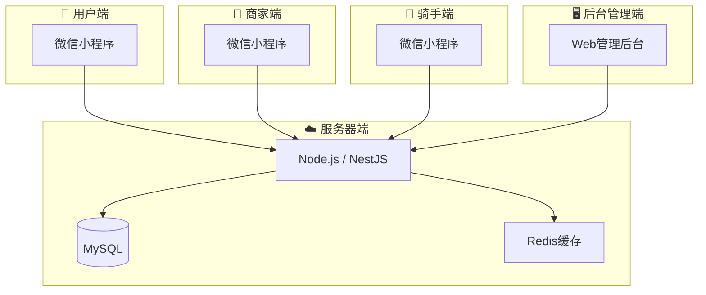

# @eastgold15/slidev-theme-jingjiang

主题组件与样式示例大全

<div class="pt-12">
  <span @click="$slidev.nav.next" class="px-2 py-1 rounded cursor-pointer" flex="~ justify-center items-center gap-2" hover="bg-white bg-opacity-10">
    Press Space for next page <div class="i-carbon:arrow-right inline-block"/>
  </span>
</div>

---
layout: circletl-br
---

# Toc 目录导航组件

使用 `<Toc>` 展示演示文稿章节列表，自动带序号、图标、标签：

<Toc :items="[
  {icon: '🎯', number: '①', title: '组件概览', desc: '所有组件一览', tag: '🌟 所有人'},
  {icon: '📦', number: '②', title: 'Card 卡片', desc: '磨砂卡片用法', tag: '🌟 所有人'},
  {icon: '📋', number: '③', title: 'Toc 目录', desc: '就是本页', tag: '🌟 所有人'},
  {icon: '⏱', number: '④', title: 'Timeline 时间线', desc: '阶段展示', tag: '🌟 所有人'},
  {icon: '🎨', number: '⑤', title: '样式工具类', desc: 'Section / DataBlock / HighlightBox', tag: '🌟 所有人'},
  {icon: '🔄', number: '⑥', title: '主题切换', desc: 'theme-project 浅色主题', tag: '🟡 技术参考'},
]" />

---
layout: circletr-bl
---

# Card 磨砂卡片

内容的基本承载容器，直角磨砂质感。

<ScrollView max-height="380px">
<Card title="默认卡片（金黄装饰条）">
内容放在这里，自动磨砂紫底 + 左侧金黄条
</Card>

<Card accent="#D4A720" title="浅色装饰条" class="mt-4">
装饰条颜色可自定义
</Card>

<Card :show-accent="false" title="无装饰条卡片" size="full" class="mt-4">
底部通栏大卡片，无装饰条
</Card>

<div class="grid grid-cols-2 gap-4 mt-4">
  <Card title="双栏左" padding="4">
    小内边距卡片
  </Card>
  <Card title="双栏右" padding="4">
    等分并列布局
  </Card>
</div>

<Card title="表格内嵌" class="mt-4">
| 项目 | 数值 | 备注 |
|------|------|------|
| 项目A | <span class="text-data">320</span> | 正常 |
| 项目B | <span class="text-data">180</span> | <span class="text-desc">暂停中</span> |
| **合计** | <span class="text-total">500</span> | |
</Card>
</ScrollView>

**使用注意：** Card 标签上下必须空一行；不要嵌套 Card，内层用 `.section-accent`

---

# Timeline 时间线组件

横向阶段块，每块带顶部色条和图标，适合项目排期。

```markdown
<Timeline :steps="[
  {icon: '📄', label: '需求分析', period: '第1-2周', accent: '#F9D240'},
  {icon: '☁️', label: '后端开发', period: '第3-6周', accent: '#7EC8E3'},
  {icon: '📱', label: '前端开发', period: '第4-8周', accent: '#6BCB9C'},
  {icon: '🚀', label: '上线发布', period: '第10周', accent: '#C792EA'},
]" />
```

效果：

<Card :show-accent="false" padding="4">
<Timeline :steps="[
  {icon: '📄', label: '需求分析', period: '第1-2周', desc: '产品设计', accent: '#F9D240'},
  {icon: '☁️', label: '后端开发', period: '第3-6周', desc: 'API接口', accent: '#7EC8E3'},
  {icon: '📱', label: '前端开发', period: '第4-8周', desc: '多端并行', accent: '#6BCB9C'},
  {icon: '🧪', label: '联调测试', period: '第7-9周', desc: 'Bug修复', accent: '#FFB74D'},
  {icon: '🚀', label: '上线发布', period: '第10周', desc: '运营准备', accent: '#C792EA'},
]" />
</Card>

---
layout: circletl-br
---

# 样式工具类：Section

`section-accent` 是轻量分区——只有左侧色条，无背景色，适合纯文字段落。

**使用场景：替代嵌套 Card**

```markdown
<div class="section-accent">

**标题** 一段说明文字

</div>
```

效果（三栏并排）：

<Card title="" :show-accent="false" padding="4">
<div class="grid grid-cols-3 gap-4">
<div class="section-accent">

**📊 信息过载**
全国 3000+ 所高校<br>700+ 专业<br>普通家庭根本理不清
</div>
<div class="section-accent">

**🎲 盲目决策**
67% 的学生凭感觉<br>44% 后悔所选专业<br>信息不对称
</div>
<div class="section-accent">

**⏰ 时间压力**
出分到填报仅 3-7 天<br>焦虑之下容易出错<br>一错影响一生
</div>
</div>
</Card>

---

# 样式工具类：DataBlock

纯文字数字展示，无需任何容器背景。

```markdown
<div class="data-block">
  <div class="data-value">1,200万+</div>
  <div class="data-label">目标用户</div>
</div>
```

效果：

<Card title="" :show-accent="false" padding="4">
<div class="grid grid-cols-3 gap-4 text-center">
<div class="data-block">
<div class="data-value">1,200万+</div>
<div class="data-label">每年高考人数</div>
</div>
<div class="data-block">
<div class="data-value">¥299</div>
<div class="data-label">人均付费意愿</div>
</div>
<div class="data-block">
<div class="data-value">¥50亿+</div>
<div class="data-label">市场规模/年</div>
</div>
</div>
</Card>

---

# 样式工具类：HighlightBox

结论强调框，有磨砂底但无装饰条。

```markdown
<div class="highlight-box">
**💡 核心结论：** 一句话总结
</div>
```

效果：

<Card title="" :show-accent="false" padding="4">
<div class="highlight-box">

**💡 核心结论：** 基础功能免费引流 → 会员/咨询变现 → B端扩大覆盖 → 数据积累形成壁垒

</div>
</Card>

<div class="highlight-box mt-4">

**🔑 差异化：** 纯工具 → AI + 人结合。基础数据免费建立信任，AI推荐提高效率，专家咨询提供深度服务。

</div>

---

# MermaidView 组件

可缩放流程图/图表容器，滚轮缩放，拖拽平移。

<MermaidView :max-height="480">



</MermaidView>

---
layout: circletl-br
class: "theme-project"
---

# 主题切换：theme-project

浅色项目分析主题，适合方案评审、商业计划书场景。

在 frontmatter 加 `class: "theme-project"` 即可。

<Card title="浅色主题效果" padding="4">
<div class="grid grid-cols-3 gap-4">
<div class="section-accent">

**📊 数据展示**
表格清晰，对比度高
</div>
<div class="section-accent">

**🎨 视觉清爽**
浅灰白底，正式不暗沉
</div>
<div class="section-accent">

**📈 商业场景**
适合方案评审、商业计划
</div>
</div>
</Card>

<Card title="数据表格" padding="4" class="mt-4">

| 项目 | 金额 | 说明 |
|------|------|------|
| 开发费用 | <span class="text-data">120,000</span> | 四端开发 |
| 服务器首月 | <span class="text-data">3,000</span> | 云服务器 |
| **合计** | <span class="text-total">123,000 元</span> | |

</Card>

---

# ScrollView 组件

无滚动条容器，滚轮翻页，Shift+滚轮左右平移。

<ScrollView max-height="360px">

## 长内容示例

这一段只是为了展示 ScrollView 的滚动效果。当内容超过容器高度时，滚轮自动垂直翻页，而且没有滚动条，不影响触控板手势。

### 继续往下翻

下面还有更多内容，你会看到 ScrollView 平滑滚动。

**数据点 1：** Lorem ipsum dolor sit amet, consectetur adipiscing elit.

**数据点 2：** Sed do eiusmod tempor incididunt ut labore et dolore magna aliqua.

**数据点 3：** Ut enim ad minim veniam, quis nostrud exercitation ullamco.

1
2
3
4
5
6
7
8
9
10

翻到底了！Shift+滚轮可以左右平移。
</ScrollView>

---

# 组件总览：什么时候用什么

<Card title="容器选择指南" padding="4">
<table>
<tr><th>要放什么</th><th>用什么</th><th>理由</th></tr>
<tr><td>标题 + 多行内容 + 表格</td><td>`&lt;Card&gt;`</td><td>需要磨砂背景承托</td></tr>
<tr><td>纯文字段落</td><td>`.section-accent`</td><td>轻量，不增加视觉重量</td></tr>
<tr><td>数字/指标展示</td><td>`.data-block`</td><td>无需卡片，纯文字干净</td></tr>
<tr><td>结论/强调</td><td>`.highlight-box`</td><td>有背景区分但不花哨</td></tr>
<tr><td>目录列表</td><td>`&lt;Toc&gt;`</td><td>自带序号和标签样式</td></tr>
<tr><td>时间阶段</td><td>`&lt;Timeline&gt;`</td><td>横向阶段条，适合排期</td></tr>
<tr><td>流程图/图表</td><td>`&lt;MermaidView&gt;`</td><td>可缩放，拖拽平移</td></tr>
<tr><td>超长内容</td><td>`&lt;ScrollView&gt;`</td><td>隐藏滚动条，触控板友好</td></tr>
</table>
</Card>
