# 体育学院2024年度工作总结

凝心聚力 开拓进取

四川大学锦江学院 体育学院
2024年12月

---

layout: circle-tl-br
---

# 工作概述

2024年是体育学院深化教学改革、推进专业建设的关键之年。全院师生凝心聚力，在教育教学、科研创新、竞赛实践等方面取得显著成效。

<Card title="年度关键数据" accent="#F9D240" padding="6">

  

    
1,286

    
在校学生总数

    
较上年增长 8.3%

  

  

    
97

    
省级以上竞赛获奖

    
含国家级金奖 12 项

  

  

    
96.2%

    
毕业生就业率

    
创学院历史新高

  

</Card>

---

layout: circle-tr-bl
---

# 专业建设数据

<ScrollView :max-height="380">

<Card title="各专业建设概况 (2024)">
| 专业名称 | 在校人数 | 专任教师 | 就业率 | 备注 |
|---------|---------|---------|-------|------|
| 体育教育 | 486 | 28 | 97.5% | 省级一流专业 |
| 社会体育指导与管理 | 352 | 18 | 95.8% | 正常招生 |
| 运动康复 | 268 | 14 | 96.1% | 新增体能训练方向 |
| 休闲体育 | 180 | 10 | 93.2% | 优化培养方案 |
| **全院合计** | 1,286 | 70 | 96.2% | |
</Card>

</ScrollView>

---

layout: circle-tl-br
---

# 重点项目建设

2024年度围绕学科发展目标，重点推进了四大建设项目，形成"教学—科研—竞赛—社会服务"四位一体的发展格局。

```mermaid
graph TB
    A["体育学院<br/>2024重点工作"] --> B["教学改革工程"]
    A --> C["科研提升工程"]
    A --> D["竞赛突破工程"]
    A --> E["社会服务工程"]

    B --> B1["智慧体育课程建设"]
    B --> B2["校企联合培养基地"]
    B --> B3["教学质量监控体系"]

    C --> C1["运动科学实验室"]
    C --> C2["省级课题立项 5 项"]
    C --> C3["发表核心论文 12 篇"]

    D --> D1["全国大学生运动会"]
    D --> D2["省大学生体育联赛"]
    D --> D3["校内体育文化节"]

    E --> E1["社区体育志愿服务"]
    E --> E2["中小学体育师资培训"]
    E --> E3["国民体质健康监测"]

    style A fill:#532B73,stroke:#9D78C2,stroke-width:2px,color:#FFFFFF
    style B fill:#532B73,stroke:#9D78C2,stroke-width:1px,color:#FFFFFF
    style C fill:#532B73,stroke:#9D78C2,stroke-width:1px,color:#FFFFFF
    style D fill:#532B73,stroke:#9D78C2,stroke-width:1px,color:#FFFFFF
    style E fill:#532B73,stroke:#9D78C2,stroke-width:1px,color:#FFFFFF
    style B1 fill:#4C2668,stroke:#9D78C2,stroke-width:1px,color:#FFFFFF
    style B2 fill:#4C2668,stroke:#9D78C2,stroke-width:1px,color:#FFFFFF
    style B3 fill:#4C2668,stroke:#9D78C2,stroke-width:1px,color:#FFFFFF
    style C1 fill:#4C2668,stroke:#9D78C2,stroke-width:1px,color:#FFFFFF
    style C2 fill:#4C2668,stroke:#9D78C2,stroke-width:1px,color:#FFFFFF
    style C3 fill:#4C2668,stroke:#9D78C2,stroke-width:1px,color:#FFFFFF
    style D1 fill:#4C2668,stroke:#9D78C2,stroke-width:1px,color:#FFFFFF
    style D2 fill:#4C2668,stroke:#9D78C2,stroke-width:1px,color:#FFFFFF
    style D3 fill:#4C2668,stroke:#9D78C2,stroke-width:1px,color:#FFFFFF
    style E1 fill:#4C2668,stroke:#9D78C2,stroke-width:1px,color:#FFFFFF
    style E2 fill:#4C2668,stroke:#9D78C2,stroke-width:1px,color:#FFFFFF
    style E3 fill:#4C2668,stroke:#9D78C2,stroke-width:1px,color:#FFFFFF
```

<MermaidView :max-height="440">

</MermaidView>

---

layout: circle-tr-bl
---

# 学生竞赛成果

<Card title="2024年度省级以上竞赛获奖统计" accent="#F9D240" padding="4">
| 赛事名称 | 金奖/一等奖 | 银奖/二等奖 | 铜奖/三等奖 |
|---------|:----------:|:----------:|:----------:|
| 全国大学生田径锦标赛 | 3 | 5 | 7 |
| 省大学生篮球联赛 | 1 | 2 | 3 |
| 省大学生健美操大赛 | 2 | 3 | 4 |
| 全国大学生武术比赛 | 1 | 4 | 2 |
| 省大学生运动会（综合） | 5 | 8 | 10 |
| **合计** | 12 | 22 | 26 |
</Card>

数据来源：体育学院竞赛管理中心，截至 2024 年 12 月。

---

layout: circle-tl-br
---

# 问题与反思

<Card title="当前不足" accent="#9E2B42" padding="5">
- 高水平师资引进力度有待加强，博士占比仅 18%
- 科研平台支撑能力不足，省级以上重点实验室尚属空白
- 校企合作深度不够，产教融合项目落地周期较长
- 国际化办学水平有待提升，暂无联合培养项目
</Card>

<Card title="改进方向" accent="#F9D240" padding="5">
- 实施"英才引进计划"，力争新增博士 3-5 名
- 申报省级运动健康重点实验室，搭建科研平台
- 深化与 5 家体育龙头企业战略合作
- 启动与国外高校的2+2联合培养项目
</Card>

---

layout: cover
---

# 感谢聆听

**携手奋进 再创辉煌**

四川大学锦江学院 体育学院
2024年12月

