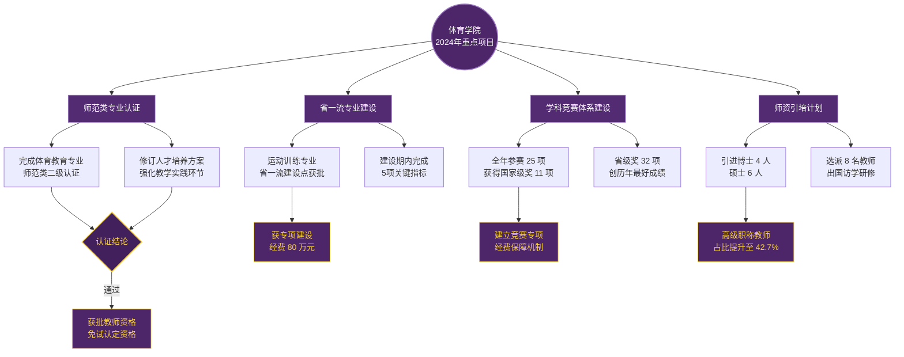

# 体育学院

述职PPT

  
    Press Space for next page 

  

---

layout: cover

# 体育学院2024年度工作总结

述职汇报

  体育学院
  2024年12月

---

layout: circletl-br

# 目录 CONTENTS

### 01 工作概述
关键数据指标一览

### 02 专业建设
学科布局与数据成果

### 03 重点项目
年度标志性工作推进

### 04 展望规划
未来工作方向与目标

---

layout: circletr-bl

# 工作概述

## 2024年体育学院核心数据指标

<Card title="在校生规模" accent="#F9D240">
  

    
1,286

    
同比增长 8.3%

  

</Card>

<Card title="专业数量" accent="#F9D240">
  

    
6

    
本科专业 + 2 个方向

  

</Card>

<Card title="就业率" accent="#F9D240">
  

    
92.7%

    
较去年提升 4.1%

  

</Card>

<Card title="科研项目" accent="#F9D240">
  

    
18

    
省部级立项 7 项

  

</Card>

<Card title="竞赛获奖" accent="#F9D240">
  

    
43

    
国家级奖项 11 项

  

</Card>

<Card title="师资队伍" accent="#F9D240">
  

    
89

    
高级职称占比 42.7%

  

</Card>

---

# 专业建设数据

## 2024年度各专业基本情况一览

<ScrollView max-height="380px">

| 专业名称 | 年级 | 在校人数 | 就业率 | 备注 |
| :--- | :--- | :---: | :---: | :--- |
| 体育教育 | 2021-2024 | 486 | 93.5% | 师范类专业认证已通过 |
| 运动训练 | 2021-2024 | 312 | 91.2% | 省一流专业建设点 |
| 社会体育指导与管理 | 2021-2024 | 208 | 90.8% | 新增休闲体育方向 |
| 武术与民族传统体育 | 2022-2024 | 126 | 94.1% | 校重点特色专业 |
| 运动人体科学 | 2021-2024 | 89 | 89.7% | 今年恢复招生 |
| 休闲体育 | 2023-2024 | 65 | — | 2023年新增专业 |
| 合计 | — | 1,286 | 92.7% | — |

</ScrollView>

  专业建设成效：
  体育教育专业通过师范类专业认证，运动训练专业获批省一流专业建设点，新增休闲体育专业并完成首次招生。

---

# 重点项目

## 2024年度重大工作推进情况

<MermaidView :max-height="420">

</MermaidView>

---

layout: circletl-br

# 展望规划

## 2025年度重点工作方向

<Card title="深化专业内涵建设" :show-accent="true" accent="#F9D240">
  <ul class="text-desc space-y-2 mt-2">
    <li>推进运动训练专业省一流验收</li>
    <li>启动社会体育指导与管理专业认证</li>
    <li>申报运动康复新专业</li>
  </ul>
</Card>

<Card title="提升科研创新能力" :show-accent="true" accent="#F9D240">
  <ul class="text-desc space-y-2 mt-2">
    <li>力争国家级课题立项 2-3 项</li>
    <li>建设校级体育科学重点实验室</li>
    <li>推动跨学科交叉研究平台落地</li>
  </ul>
</Card>

<Card title="优化师资队伍结构" :show-accent="true" accent="#F9D240">
  <ul class="text-desc space-y-2 mt-2">
    <li>引进高层次人才 5-8 人</li>
    <li>培育省级教学名师 1-2 人</li>
    <li>完善青年教师导师制培养体系</li>
  </ul>
</Card>

<Card title="拓展社会服务能力" :show-accent="true" accent="#F9D240">
  <ul class="text-desc space-y-2 mt-2">
    <li>建设全民健身志愿服务品牌</li>
    <li>深化校地合作体育培训项目</li>
    <li>打造区域体育赛事服务中心</li>
  </ul>
</Card>

---

layout: cover

# 感谢聆听

## 恳请各位领导批评指正

  体育学院
  2024年12月

