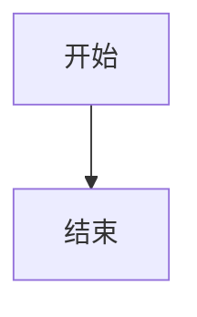
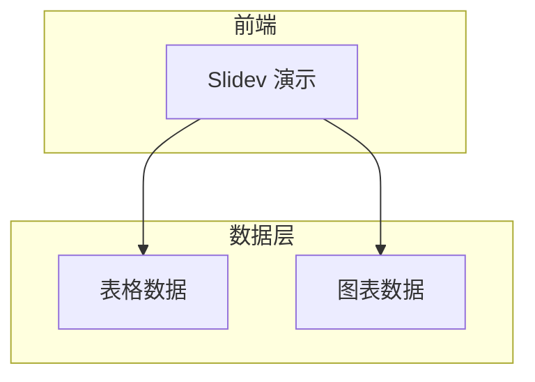
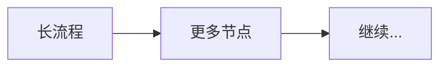

# 锦江主题（@eastgold15/slidev-theme-jingjiang）完整指南

## 一、布局 Layouts

锦江主题共提供 **4 种布局**，在每页的 frontmatter 中通过 `layout:` 指定。

| 布局名 | frontmatter 值 | 视觉特征 | 适用场景 |
|--------|---------------|---------|---------|
| **封面页** | `cover` | 居中对称大标题 + 副标题 + 浅紫分割线 + 页脚（单位/日期），纯白大字加粗，极简政务风 | 演示文稿首页、尾页（感谢页）、重要章节的开场白 |
| **简介页** | `intro` | 同封面风格，视觉一致 | 目录页、章节过渡页、述职人介绍页 |
| **左上右下圆** | `circle-tl-br` | 双透明圆形装饰背景（左上 + 右下），正文标准版式 | 正文内容页（数据展示、表格、文字论述等），**推荐为主要正文布局** |
| **右上左下圆** | `circle-tr-bl` | 双透明圆形装饰背景（右上 + 左下），对称变体 | 正文内容页的**交替变体**，与 `circle-tl-br` 交替使用可避免连续页面视觉单调 |

### 布局使用技巧

- **首尾页**：始终使用 `cover`
- **章节过渡**：使用 `intro`
- **正文交替**：奇数页用 `circle-tl-br`，偶数页用 `circle-tr-bl`，形成节奏感
- **无需指定布局的页面**：不写 `layout` 则使用 Slidev 默认基础布局（无装饰圆），适合纯文字说明页

---

## 二、组件 Components

### 2.1 Card — 磨砂质感卡片

内容的基本承载容器，直角矩形、不透光哑光磨砂质感、无阴影无渐变。

```markdown
<Card title="标题" accent="#F9D240">
  卡片内容
</Card>
```

**属性：**

| 属性 | 类型 | 默认值 | 说明 |
|------|------|--------|------|
| `accent` | string | `#F9D240` | 左侧装饰条颜色 |
| `show-accent` | boolean | `true` | 是否显示装饰条 |
| `padding` | number | `6` | 内边距（UnoCSS p-X） |
| `size` | `normal`/`full`/`sm` | `normal` | 卡片尺寸 |
| `title` | string | — | 卡片标题（带底部分割线） |
| `mb` | number | `0` | 底部外边距 |

**常用布局模式：**

```markdown
<!-- 标准卡片 -->
<Card title="默认卡片" accent="#F9D240" padding="6">
  标准磨砂卡片
</Card>

<!-- 底部通栏大卡片，无装饰条 -->
<Card :show-accent="false" size="full">
  底部通栏大卡片，无装饰条
</Card>

<!-- 双栏并列 -->
<div class="grid grid-cols-2 gap-4">
  <Card title="左栏" padding="4" />
  <Card title="右栏" padding="4" />
</div>

<!-- 三栏数据展示 -->
<Card title="年度关键指标" padding="4">
<div class="grid grid-cols-3 gap-4 text-center">
  <div>
    <div class="text-4xl text-data font-bold">128</div>
    <div class="text-desc">授课课时</div>
  </div>
  <div>
    <div class="text-4xl text-data font-bold">96%</div>
    <div class="text-desc">学生满意度</div>
  </div>
  <div>
    <div class="text-4xl text-data font-bold">3</div>
    <div class="text-desc">科研项目</div>
  </div>
</div>
</Card>
```

### 2.2 MermaidView — 可缩放流程图/图表容器

鼠标滚轮缩放（以光标为中心），拖拽平移。

```markdown
<MermaidView :max-height="480">



</MermaidView>
```

**属性：**

| 属性 | 类型 | 默认值 | 说明 |
|------|------|--------|------|
| `max-height` | string | `400px` | 容器最大高度 |

**操作方法：**

| 操作 | 效果 |
|------|------|
| 鼠标滚轮 | 以光标为中心放大/缩小 |
| 鼠标拖拽 | 平移图表 |
| 右上角 **+** / **-** 按钮 | 逐级缩放 |
| 右上角 **⟲** 按钮 | 重置到初始视图 |

### 2.3 ScrollView — 无滚动条滚动容器

整个容器隐藏滚动条，适合放置超长内容。

```markdown
<ScrollView max-height="400px">
超长内容...
</ScrollView>
```

**属性：**

| 属性 | 类型 | 默认值 | 说明 |
|------|------|--------|------|
| `max-height` | string | `100%` | 容器最大高度 |
| `max-width` | string | `100%` | 容器最大宽度 |

**操作方法：** 滚轮垂直翻页 | Shift + 滚轮水平平移

### 2.4 表格规范

表格必须内嵌在磨砂卡片中使用，表头深紫底 + 白色加粗文字，仅有水平浅紫分割线。

```markdown
<Card title="数据总览">
| 专业名称 | 在校人数 | 备注 |
|---------|---------|------|
| 体育教育 | <span class="text-data">320</span> | 正常招生 |
| 社会体育 | <span class="text-data">180</span> | <span class="text-desc">暂停招生</span> |
| **全院总计** | <span class="text-total">500</span> | |
</Card>
```

---

## 三、在封面里添加单位和日期

使用封面的 `cover-footer` 结构。`cover-footer` 是一个左右两栏的布局：左侧放单位名称，右侧放日期。

```yaml
---
layout: cover
---

# 2024年度工作总结汇报

述职人：张三

<div class="cover-divider" />

<div class="cover-footer">
<span>四川大学锦江学院 体育学院</span>
<span>2024年12月</span>
</div>
```

**关键要点：**

| 部分 | CSS 类名 | 说明 |
|------|---------|------|
| 分割线 | `<div class="cover-divider" />` | 浅紫细水平分割线，分隔标题区与页脚 |
| 页脚容器 | `<div class="cover-footer">` | flex 左右两栏自动排版 |
| 左侧内容 | 第一个 `<span>` | 单位全称，左对齐 |
| 右侧内容 | 第二个 `<span>` | 日期，右对齐 |

**注意：** 不需要额外写 CSS 样式，直接使用这三个类名即可。封面页的尾页（感谢页）也使用完全相同的结构。

如果您需要更多行（如副标题有多行），直接在标题下方用空行分隔的自然段落即可——紧接 `h1` 的第一个段落会自动变为浅灰紫副标题样式。

---

## 四、放大查看 Mermaid 图表

锦江主题提供了 **MermaidView** 组件，专用于放大查看 Mermaid 图表。

### 基本用法

用 `<MermaidView>` 标签包裹 Mermaid 代码块：

```yaml
---
layout: circle-tl-br
---

# 系统架构图

<MermaidView :max-height="480">



</MermaidView>
```

### 四种缩放操作

1. **鼠标滚轮** — 在图表区域滚动滚轮，以光标位置为中心进行缩放
2. **鼠标拖拽** — 按住鼠标左键拖拽，平移图表视野
3. **右上角 +/- 按钮** — 点击 + 放大、点击 - 缩小
4. **右上角 ⟲ 重置按钮** — 一键恢复到初始缩放比例和位置

### 调整容器高度

通过 `:max-height` 属性控制图表容器的高度（默认 `400px`）。如果图表较宽，建议设大一些（如 `480`、`560`）：

```markdown
<!-- 较大的图表 -->
<MermaidView :max-height="560">



</MermaidView>

<!-- 较小的图表 -->
<MermaidView :max-height="320">
...
</MermaidView>
```

---

## 五、色彩系统与文字层级

### 双主题切换

| 主题 | 启用方式 | 特点 |
|------|---------|------|
| **深紫主主题** | 默认（不需指定） | 哑光深紫底，稳重正式，适合内部汇报、述职 |
| **浅紫备用主题** | 在 frontmatter 加 `class: "theme-light"` | 明亮视觉，适合对外宣讲、学术答辩 |

### 四色文字工具类

| UnoCSS 类 | 适用场景 | 色值 |
|-----------|---------|------|
| （默认纯白） | 大章节标题、卡片标题、表头 | `#FFFFFF` |
| `text-data` | 关键数据、数字高亮（加粗金黄） | `#F9D240` |
| `text-desc` | 正文说明、备注、数据来源 | `#D1C4E0` |
| `text-total` | 总计/汇总行（加粗暗酒红大号） | `#9E2B42` |

**核心原则：** 金黄只用于数字和关键论据，小面积点缀；暗酒红只用于总计，不与金色同屏。

---

## 六、推荐内容结构

### 专业申报场景

```
封面页 (cover) → 目录 (intro) → 现状与背景 →
数据总览 → 专业详情（卡片双栏）→ 调整方案 →
师资与资源 → 总结（通栏重点高亮）→ 感谢页 (cover)
```

### 述职汇报场景

```
封面页 (cover) → 工作概述 → 核心成果（数据卡片）→
重点项目（时间线/架构图）→ 问题与反思 →
下一步计划 → 结语 → 感谢页 (cover)
```

### 学术答辩场景

```
封面页 (cover) → 目录 (intro) → 研究背景/选题意义 →
文献综述 → 研究方法 → 数据分析（MermaidView）→
结论与创新点 → 感谢页 (cover)
```

---

## 七、快速记忆卡

| 你想做什么 | 用什么 |
|-----------|--------|
| 起一个好标题 | `# h1`，纯白 6xl 加粗居中 |
| 加副标题 | h1 后的首段 `p`，自动变浅灰紫 |
| 封面加单位和日期 | `<div class="cover-footer"><span>...</span><span>...</span></div>` |
| 放一张卡片 | `<Card>` 组件 |
| 并列多张卡片 | `<div class="grid grid-cols-2 gap-4">` |
| 放表格 | 在 `<Card>` 里写 Markdown 表格 |
| 关键数字高亮 | `<span class="text-data">` |
| 放流程图 | `<MermaidView>` 包裹 ` ```mermaid ``` |
| 放大看图表 | 滚轮缩放 / 拖拽平移 / 右上角 +/- 和 ⟲ |
| 超长内容 | `<ScrollView>` 包裹 |
| 换浅色主题 | frontmatter 加 `class: "theme-light"` |
