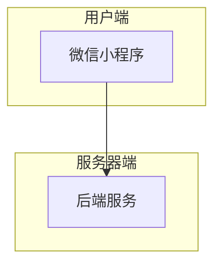
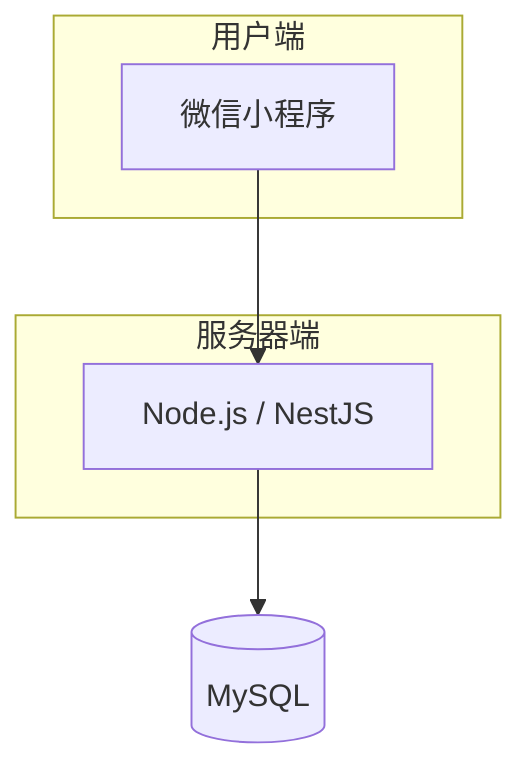
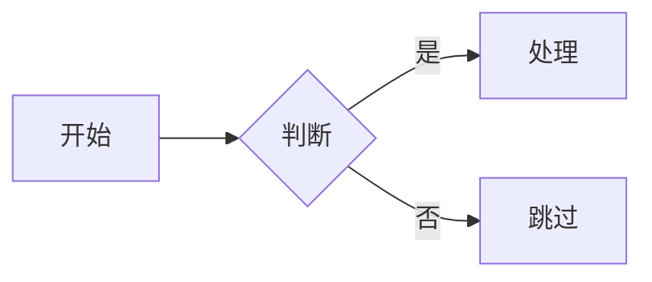

# @eastgold15/slidev-theme-jingjiang 主题指南

> 深紫哑光磨砂政务风 Slidev 主题，适配高校专业申报、述职汇报场景。

---

## 一、布局（Layouts）

本主题提供 4 种自定义布局。

### 1. cover（封面页）

**模板代码：**

```yaml
---
layout: cover
---
```

**视觉效果：** 居中对称，超大加粗白色主标题 + 浅灰副标题 + 浅紫细水平分割线 + 页脚左右分栏。支持通过 `background` 属性设置背景图片。

**适用场景：** 演示文稿的第一页，用于展示主标题、汇报单位、日期。正式、庄重，适合政务/学术/申报类汇报的开场。

---

### 2. intro（简介页）

**模板代码：**

```yaml
---
layout: intro
---
```

**视觉效果：** 与 `cover` 相同的居中风格，内容区域垂直居中。

**适用场景：** 演示文稿的第二页或章节开头，用于简要介绍背景、目录或整体概况。与封面风格统一，形成自然过渡。

---

### 3. circle-tl-br（左上右下双圆装饰）

**模板代码：**

```yaml
---
layout: circle-tl-br
---
```

**视觉效果：** 页面左上角和右下角各有一个半透明圆形装饰，丰富背景层次。

**适用场景：** 目录页、章节分隔页、数据展示页。双圆装饰打破单调背景，添加层次感的同时不影响文字可读性。

---

### 4. circle-tr-bl（右上左下双圆装饰）

**模板代码：**

```yaml
---
layout: circle-tr-bl
---
```

**视觉效果：** 与 `circle-tl-br` 对称，圆形装饰位于右上角和左下角。

**适用场景：** 正文内容页、列表页、要点陈述页。与 `circle-tl-br` 搭配交替使用，保持页面变化又不失统一。

---

## 二、组件（Components）

### 1. Card（磨砂卡片）

**用途：** 内容承载容器，哑光磨砂紫底（`#532B73`），可选左侧金色装饰条。

**属性：**

| 属性 | 类型 | 默认值 | 说明 |
|------|------|--------|------|
| `accent` | string | `#F9D240` | 左侧装饰条颜色 |
| `show-accent` | boolean | `true` | 是否显示装饰条 |
| `padding` | number | `6` | 内边距（UnoCSS p-X） |
| `size` | `normal \| full \| sm` | `normal` | 卡片尺寸 |
| `title` | string | — | 卡片标题（带底部分割线） |
| `mb` | number | `0` | 底部外边距 |

**使用场景：** 信息分组展示、数据卡片、双栏/三等分并列布局、底部通栏汇总。

**示例：**

```markdown
<Card title="专业概况" accent="#F9D240">
  标准磨砂卡片，左侧金色竖条
</Card>

<Card :show-accent="false" size="full">
  底部通栏大卡片，无装饰条
</Card>

<div class="grid grid-cols-2 gap-4">
  <Card title="左栏" padding="4" />
  <Card title="右栏" padding="4" />
</div>
```

---

### 2. MermaidView（可缩放流程图容器）

**用途：** 为 Mermaid 图表提供可缩放、可拖拽的查看容器，弥补 Slidev 原生 Mermaid 无法缩放的不足。

**属性：**

| 属性 | 类型 | 默认值 | 说明 |
|------|------|--------|------|
| `max-height` | string | `400px` | 容器最大高度 |

**操作方式：**

| 操作 | 效果 |
|------|------|
| 鼠标滚轮 | 以鼠标位置为中心缩放 |
| 鼠标拖拽 | 平移视图 |
| 点击工具栏 `+` / `−` | 以画面中心放大/缩小 |
| 点击工具栏 `⟲` | 重置缩放到 100% |

**使用场景：** 系统架构图、流程图、思维导图、ER 图等需要详细查看的大图。

**示例：**

```markdown
<MermaidView :max-height="480">


</MermaidView>
```

---

### 3. ScrollView（无滚动条滚动容器）

**用途：** 隐藏原生滚动条的滚动容器，保持界面整洁，不影响触控板手势。

**属性：**

| 属性 | 类型 | 默认值 | 说明 |
|------|------|--------|------|
| `max-height` | string | `100%` | 容器最大高度 |
| `max-width` | string | `100%` | 容器最大宽度 |

**操作方式：**

| 操作 | 效果 |
|------|------|
| 鼠标滚轮 | 垂直翻页（默认） |
| Shift + 鼠标滚轮 | 水平平移 |

**使用场景：** 长文本内容、代码展示、表格数据、多图列表等超出页面高度的内容。

**示例：**

```markdown
<ScrollView max-height="500px">
超长内容在这里会自动滚动，没有滚动条干扰视觉
</ScrollView>
```

---

## 三、如何在封面页中添加单位和日期

由于封面布局本质上是一个 `<slot />`，你可以在 Markdown 中自由编排内容。推荐以下做法：

### 推荐做法：在标题下方使用 HTML 排版

```yaml
---
layout: cover
---

# 四川大学锦江学院专业设置调整方案

专业申报与优化论证报告

<div class="pt-12 flex justify-between text-sm text-gray-300">
  <span>四川大学锦江学院 教务处</span>
  <span>2026 年 6 月</span>
</div>
```

### 要点说明

- **左侧放单位**（四川大学锦江学院 教务处），**右侧放日期**（2026 年 6 月）
- 使用 `flex justify-between` 实现左右分栏
- `pt-12` 将页脚推到分割线下方足够位置
- 文字颜色使用 `text-gray-300` 或 `#D1C4E0`（浅灰紫），与封面正式风格统一
- 如需日期动态更新，可使用 Vue 表达式：

```html
<span>{{ new Date().toLocaleDateString('zh-CN', { year: 'numeric', month: 'long' }) }}</span>
```

### 如果需要更复杂的页脚（如添加校徽）

可进一步使用网格布局：

```markdown
<div class="grid grid-cols-2 gap-4 pt-12 text-sm text-gray-300">
  <div class="text-left">四川大学锦江学院 教务处</div>
  <div class="text-right">2026 年 6 月</div>
</div>
```

---

## 四、如何放大查看 Mermaid 图表

直接使用 `<MermaidView>` 组件包裹 `mermaid` 代码块即可。

### 完整示例

```markdown
<MermaidView :max-height="480">


</MermaidView>
```

### 四种缩放操作

| 操作方式 | 细节说明 |
|----------|----------|
| **鼠标滚轮** | 以鼠标指针所在位置为缩放中心，向前放大，向后缩小 |
| **鼠标拖拽** | 按住鼠标左键拖拽，图表跟随移动 |
| **工具栏 `+` / `−`** | 以画面中心为基准，每次增减 25% |
| **工具栏 `⟲`** | 一键重置为 100%，回到初始位置 |

缩放范围被限制在 **25% 到 300%** 之间，超出边界自动截断。

### 组合使用 MermaidView + ScrollView

当页面既有长文本又有图表时，可以嵌套使用：

```markdown
<ScrollView max-height="500px">

## 系统架构说明

这里有一段很长的架构说明文字...

<MermaidView :max-height="400">


</MermaidView>

</ScrollView>
```

---

## 五、适用场景速查表

| 场景 | 推荐布局 | 推荐组件 |
|------|----------|----------|
| 首页封面 | `cover` | — |
| 目录/章节概览 | `intro` / `circle-tl-br` | — |
| 正文内容页 | `circle-tr-bl` | Card, ScrollView |
| 数据对比展示 | 任意内容布局 | Card（多栏并列） |
| 系统架构展示 | 任意内容布局 | MermaidView |
| 长文本/代码块 | 任意内容布局 | ScrollView |
| 底部汇总信息 | 任意内容布局 | Card（size=`full`） |

---

## 六、配色体系参考

| 用途 | 色值 | 说明 |
|------|------|------|
| 页面背景 | `#42205C` | 哑光深紫 |
| 卡片底色 | `#532B73` | 磨砂紫 |
| 表头底色 | `#4C2668` | 加深紫 |
| 分割线 | `#9D78C2` | 浅紫 |
| 高亮数据 | `#F9D240` | 金黄 |
| 辅助文字 | `#D1C4E0` | 浅灰紫 |
| 总计/强调 | `#9E2B42` | 暗酒红 |

---

> 版本：0.1.0 | 包名：`@eastgold15/slidev-theme-jingjiang`
